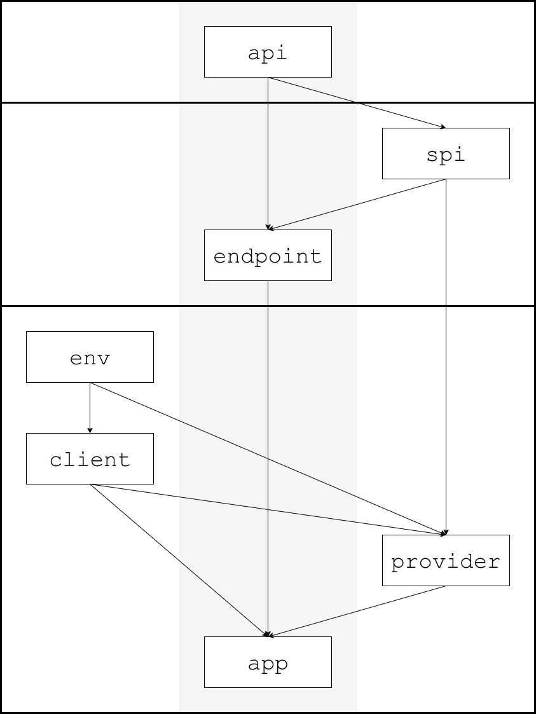

# Architecture

**Audience:** Engineers who build web applications, but may not build them in Java.

**Controlling Idea:** The product exhibits craftsmanship because of the architectural choices that were made.

- Focus on getting things done. Frameworks can help, but they can also become a distraction.
- Quality matters. That includes unit tests.

**I just want to jump into the code.**

See [`SiteEndpoint`](/site/endpoint/src/main/java/org/example/age/site/endpoint/SiteEndpoint.java)/[`AvsEndpoint`](/avs/endpoint/src/main/java/org/example/age/avs/endpoint/AvsEndpoint.java), [`SiteApp`](/site/app/src/main/java/org/example/age/site/app/SiteApp.java)/[`AvsApp`](/avs/app/src/main/java/org/example/age/avs/app/AvsApp.java), or [`Demo`](/demo/src/main/java/org/example/age/demo/Demo.java).

## Tech Stack

**Web APIs**

- **[OpenAPI](https://www.openapis.org/):** Defines web APIs using a language-agnostic framework. A natural starting point given our audience.

**Java Web APIs and Web Clients**

Go POJO: Plain Old Java Object. Getting things done is easier when you work with POJO interfaces.

- **[JAX-RS](https://jakarta.ee/specifications/restful-ws/4.0/):** Creates web APIs as annotated POJO interfaces. ([Generated](/buildSrc/src/main/kotlin/openapi-java.gradle.kts) from the OpenAPI YAML.)
- **[Retrofit](https://square.github.io/retrofit/):** Creates web clients as annotated POJO interfaces. (Generated from the OpenAPI YAML.)
- **[Immutables](https://immutables.github.io/) + [Jackson](https://github.com/FasterXML/jackson):** Creates value types for JSON data as annotated POJO interfaces.

**Java Web Applications**

- **[Dropwizard](https://www.dropwizard.io/):** Web application framework that focuses on getting things done&mdash;and has a shallow learning curve.
- **[Dagger](https://dagger.dev/):** Dependency injection framework. Dependencies are injected at compile-time; mistakes are compilation errors.

**Stores**

- **[DynamoDB](https://aws.amazon.com/dynamodb/)**
- **[Redis](https://redis.io/)**

## Detailed Design

Gradle is the build system. The code is split into multiple subprojects (e.g., `:site:api`, `:site:endpoint`).

### Project Structure

- Only `app` depends on Dropwizard; no knowledge of Dropwizard is needed to understand the other components.
- `endpoint`, `client`, and `provider` all contain JSON configuration.
- (Dagger, not `META-INF`, will be used to provide implementations of the SPIs.)

**API Layer**

- `api`: the OpenAPI YAML file, as well as the corresponding model types, JAX-RS interface, and Retrofit interface

**Endpoint Layer**

- `spi`: service provider interfaces that abstract away data stores (i.e., DAOs) and cryptographic operations
- `endpoint`: implementation of the JAX-RS interface that only contains pure business logic

**Application Layer**

- `env`: [`LiteEnv`](/common/env/src/main/java/org/example/age/common/env/LiteEnv.java), a lightweight facade for the Dropwizard `Environment`, and some related utilities
- `client`: clients for other endpoints and data stores
- `provider`: implementations of the SPIs
- `app`: web application

A Dropwizard `Application` only needs to implement one method: `void run(T configuration, Environment environment)`.

- The configuration class is a [container](/site/app/src/main/java/org/example/age/site/app/config/SiteAppConfig.java) for all the configuration from `endpoint`, `client`, and `provider`.
- `app` includes an [implementation](/common/app/src/main/java/org/example/age/common/app/env/DropwizardLiteEnv.java) of the `LiteEnv` facade using the Dropwizard `Environment`.
- Since a proof-of-concept is not deployed to production, ops features are excluded: health checks, metrics, logging, etc.

### Testability

- A key component of quality is thorough unit tests.
- Testability is downstream of the architecture.

**Unit Tests**

- `endpoint` only contains pure business logic, but providers for `spi` are needed to test it.
    - Very lightweight, self-contained fakes for `spi` can be found in `:common|site|avs:provider:testing`.
    - In turn, these fakes may not implement expiration logic, use preset accounts, hard-code configuration, etc.
- An implementation of `LiteEnv` is needed to test `client` and `provider`.
    - A self-contained [test implementation](/testing/src/main/java/org/example/age/testing/env/TestLiteEnv.java) of `LiteEnv` can be found in `:testing`.
- Test templates for `spi` can be found in `:common|site|avs:spi-testing`; consumers will provide an implementation of the SPI.

**Integration Tests**

- A [test template](/integration-testing/testing/src/main/java/org/example/age/testing/integration/VerificationTestTemplate.java) can be found in `:integration-testing:testing`; consumers will provide the clients.
- In `:integration-testing:app`, these clients are pointed at Docker containers running the applications.
- In `:integration-testing:endpoint`, these clients are pointed at endpoint objects (that use the fakes for `spi`).

**Test Infrastructure**

- Dropwizard and Retrofit provide great test infrastructure.
- Docker containers are used to run DynamoDB and Redis.
    - Each subproject that uses DynamoDB and/or Redis has its own `docker-compose-test.yml`.
- Additional test infrastructure can be found in `:testing`. It's fairly lightweight and minimal.

## Architectural Complications

**OpenAPI: Duplicate Types**

*Problem:* OpenAPI generates two versions of the code for both the models and the APIs.

- The OpenAPI generator is called twice: once for the server (JAX-RS), and once for the client (Retrofit).

*Solution:* Deduplicate models, but not the APIs.

- Separate client and server APIs make sense, but add [`AsyncCalls`](/common/api/src/main/java/org/example/age/common/api/client/AsyncCalls.java) as an adapter between them. See: square/retrofit#573
- The models should be deduplicated, however. The generated model types for JAX-RS should be reused for Retrofit.
- **Downside**: In `build.gradle.kts`, the `openApiJava` block must manually list out all the schemas (`dedupSchemas`).

**OpenAPI: Java Conventions**

*Problem:* The [convention plugin](/buildSrc/src/main/kotlin/buildlogic.java-conventions.gradle.kts) (Spotless, ErrorProne, `-Werror`, etc.) is not compatible with generated code.

- `api` contains types that are generated from an OpenAPI YAML file; this code does not always follow the conventions.
- `api` also contains a few hand-coded types (e.g., `SecureId`); conventions should apply to this code.
- Putting generated and hand-coded types in separate Gradle projects would create a circular dependency between projects.

*Solution:* Apply conventions to `api` on a best-effort basis.

- Spotless and ErrorProne have options to exclude files by path; this can be used to exclude generated code.

**Request Context: Dagger, Dropwizard, and OpenAPI**

*Problem:* How do I access the HTTP headers for a request? We cannot add a `@Context HttpHeaders` arg to...

- the `@Inject`'ed constructor. The Dagger component produces a singleton-scoped endpoint that is registered with Jersey.
- the methods of the JAX-RS interface. This interface is generated from the OpenAPI YAML file.
    - This solution is not ideal anyway, since the headers are used for cross-cutting concerns.

*Solution:* [DARC](https://github.com/mikewacker/darc)

**Unit Testing an Endpoint**

*Problem:* What is the difference between throwing `NotFoundException` and returning it in a failed `CompletionStage`?

- End-to-end, both would result would in a 404 error.
- When unit testing an endpoint object, those are two different outcomes.

*Solution:* Create a proxy that converts an uncaught exception to a failed `CompletionStage`. See: [`TestAsyncEndpoints`](/testing/src/main/java/org/example/age/testing/client/TestAsyncEndpoints.java)
